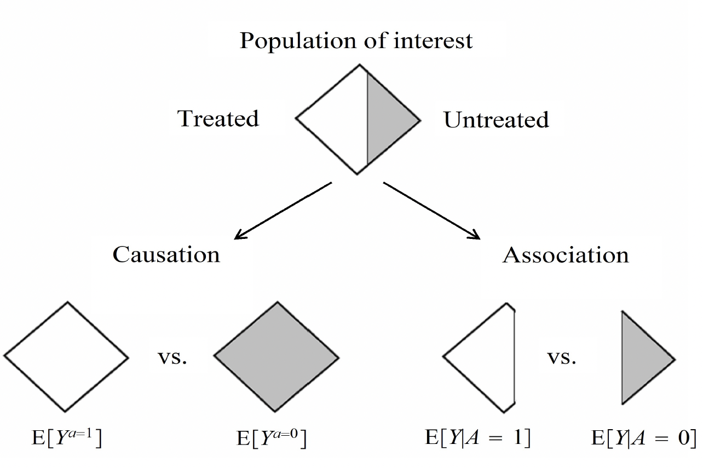
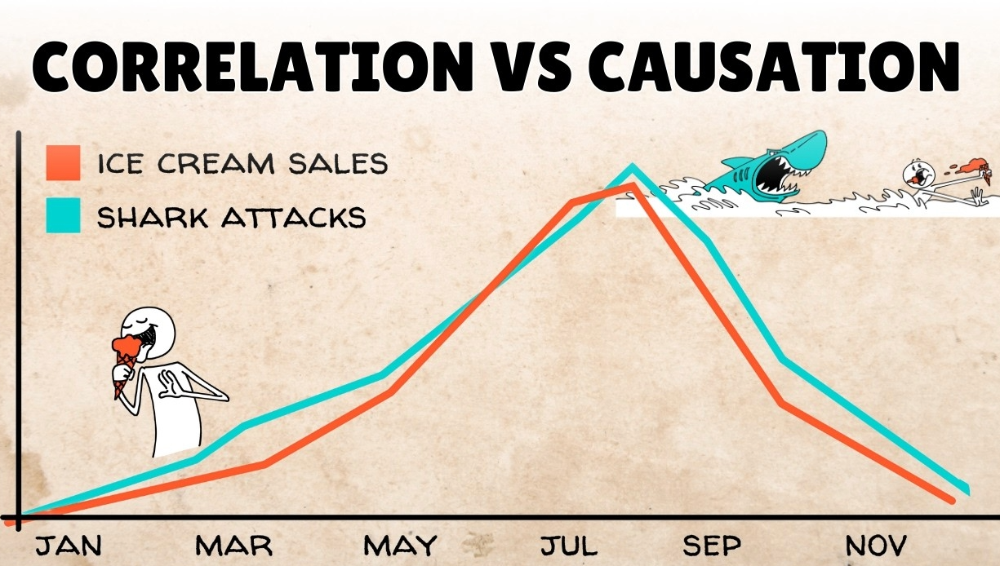

---
format:
  revealjs:
    theme: [white, custom.scss]
    width: 1050
    height: 700
    auto-stretch: false
    embed-resources: true   
    self-contained: true 
    slide-number: true
    progress: true
    highlight-style: github
    footer: "IADR 2026 - LMTP for Dental Public Health Research"
    transition: slide
    background-transition: fade
    chalkboard: false
    code-line-numbers: true
    fig-align: center
    smaller: false
execute:
  warning: false
  message: false
  cache: true
---

```{r}
#| label: setup
#| echo: false
#| include: false
#| cache: false

library(tidyverse)
library(lmtp)
library(SuperLearner)
library(broom)
library(patchwork)
library(knitr)
library(kableExtra)
library(ggdag)
library(dagitty)

theme_set(
  theme_minimal(base_size = 12) +
    theme(
      plot.title = element_text(face = "bold"),
      panel.grid.minor = element_blank()
    )
)

pal <- c(
  "Observed"      = "#2980b9",
  "Intervention"  = "#e74c3c",
  "No Decay"      = "#27ae60",
  "Decay"         = "#e74c3c"
)
```

```{r}
#| label: generate-data
#| echo: false
#| include: false
#| cache: true

set.seed(2025)
n <- 1000

# Socioeconomic covariates
age       <- round(pmax(18, pmin(70, rnorm(n, 38, 13))))
sex       <- rbinom(n, 1, 0.50)          # 1 = female
income    <- sample(1:4, n, TRUE,         # 1=low … 4=high
                    prob = c(.22, .30, .30, .18))
education <- sample(1:3, n, TRUE,         # 1=low, 2=mid, 3=high
                    prob = c(.30, .42, .28))

# Sugar consumption (g/day): higher in low SES, young adults
sugar_mu        <- 68 - 6*income - 4*education + 5*(age < 30) - 3*(age > 50)
sugar_consumption <- pmax(5, sugar_mu + rnorm(n, 0, 18))

# Tooth decay: caused by sugar AND SES (income/education)
log_odds  <- -2.1 + 0.032*sugar_consumption - 0.018*age +
              0.40*sex - 0.38*income - 0.25*education
p_decay   <- plogis(log_odds)
tooth_decay <- rbinom(n, 1, p_decay)

dental_data <- tibble(
  sugar_consumption, tooth_decay,
  age, sex, income, education
)

# Shift functions
policy_reduce_20 <- function(data, trt) {
  a <- data[[trt]]
  ifelse(a > 50, a - 20, a)
}

policy_reduce_10pct <- function(data, trt) {
  a <- data[[trt]]
  a * 0.9
}

dental_data_shifted <- dental_data |>
  mutate(
    sugar_shifted_20 = policy_reduce_20(dental_data, "sugar_consumption"),
    sugar_shifted_10pct = policy_reduce_10pct(dental_data, "sugar_consumption")
  )
```


## {background-image="image2.png" background-size="contain" background-color="#1a252f"}

---


## The Policymaker's Dilemma {background-color="#1a252f"}

::: columns
::: {.column width="55%"}
::: {style="font-size: 1.3em; color: white; line-height: 1.3;"}
Imagine you are a policymaker with a $1M public health budget.

[*What kind of evidence would you demand before investing?*]{.blue}

:::

<br>

::: {.fragment .fade-in}
::: {style="background-color: rgba(255, 255, 255, 0.05); padding: 0.8em; border-left: 5px solid #e74c3c; margin-bottom: 0.8em; border-radius: 4px; color: white;"}
**A. Associative Evidence**
*"Sugar and dental decay go hand in hand."*
:::
:::

::: {.fragment .fade-in}
::: {style="background-color: rgba(255, 255, 255, 0.05); padding: 0.8em; border-left: 5px solid #27ae60; border-radius: 4px; color: white;"}
**B. Causal Evidence**
*"If we reduce sugar consumption by 20g per day, we avert 15% of all new dental disease."*
:::
:::


::: {.fragment .fade-in}
::: {style="color: #f39c12; font-size: 1.25em; font-weight: bold; text-align: center;"}
You need causal answers, not just correlations.
:::
:::
:::

::: {.column width="45%"}
{style="border-radius: 10px; border: 2px solid #2980b9;"}
:::
:::


## The Problem: Association ≠ Causation

::: columns
::: {.column width="50%"}
{width="100%" style="border-radius: 8px; box-shadow: 0px 4px 12px rgba(0,0,0,0.1);"}
:::

::: {.column width="50%"}
<br>

[**🔍 Association (Comparing Subgroups)**]{.blue}

- **The Approach:** We partition the observed data.
- **The Contrast:** We compare the dental outcomes of the "high sugar" fraction directly against the "low sugar" fraction.
- **The Focus:** Contrasting different subsets of people.

:::{.fragment}
[**🎯 Causation (Contrasting the Whole Population)**]{.blue}

- **The Approach:** We construct counterfactual scenarios.
- **The Contrast:** We compare the *entire* population's actual outcomes against the *entire* population's expected outcomes under a new policy.
- **The Focus:** Contrasting the exact same population under different conditions.
:::
:::
:::

## What Can Regression Tell Us?

::: columns

<br>

::: {.column width="55%"}
| Regression CAN tell us: | Regression CANNOT tell us: |
|------------------------|----------------------------|
| "People who eat more sugar tend to have more cavities" | "If we reduce sugar, fewer people will get cavities" |
| Variables are related | What would happen under a POLICY |
| Prediction | Causation |

<br>

::: {style="background-color: rgba(221, 204, 204, 0.05); padding: 0.8em; border-left: 5px solid #e74c3c; margin-bottom: 0.8em; border-radius: 4px; color: black;"}
**Key message:** Regression models isolate robust predictive patterns. However, unmeasured structural confounding ensures these statistical associations frequently fail to translate into causal policy impacts.
:::

:::

::: {.column width="45%"}
{width="100%" style="border-radius: 8px; box-shadow: 0px 4px 12px rgba(0,0,0,0.1);"}
:::
:::

---

## What is Exchangeability?

::: columns
::: {.column width="50%"}
<br>

**Exchangeability**
To make valid causal claims, the groups we compare must be fundamentally similar across all relevant dimensions before the intervention. We require a true "apples to apples" comparison.

<br>

**Confounding**
When structural factors such as baseline income or education differ systematically between groups, exchangeability breaks down. 
The comparison becomes "apples to oranges," (direct contrasts are biased).
:::

::: {.column width="50%"}
{width="100%" style="border-radius: 8px; box-shadow: 0px 4px 12px rgba(0,0,0,0.1);"}
:::
:::


## Our Dataset

::: {style="background-color: rgba(162, 182, 223, 0.29); padding: 0.8em; border-left: 5px solid #27ae60; border-radius: 4px;"}
[**Causal Evidence:**]{.blue}
*"If we reduce sugar consumption by 20g per day, what is the amount of new dental caries we avert in the population"*
:::

<br>

:::: {.columns}
::: {.column width="55%"}

A cross-sectional study of **`r n` adults**:

| Variable | Description |
|---|---|
| `sugar_consumption` | Daily sugar intake (g/day) |
| `tooth_decay` | Cavities present? (1=Yes, 0=No) |
| `age` | Age in years |
| `sex` | 0=Male, 1=Female |
| `income` | 1 (low) → 4 (high) |
| `education` | 1 (low) → 3 (high) |

:::
::: {.column width="45%"}

```{r}
#| echo: false
#| fig-height: 6
dental_data |>
  ggplot(aes(sugar_consumption,
             fill = factor(tooth_decay,
                           labels = c("No Decay","Decay")))) +
  geom_histogram(bins = 30, position = "identity",
                 alpha = 0.7, colour = "white") +
  scale_fill_manual(values = pal[c("No Decay","Decay")],
                    name = NULL) +
  labs(title = "Sugar Consumption by Outcome",
       x = "Daily Sugar (g/day)", y = "Count") +
  theme(legend.position = "top")
```

:::
::::

::: {.fragment}
**Overall decay prevalence: `r scales::percent(mean(dental_data$tooth_decay), 0.1)`**
:::


---

## Structure of Confounding

:::: {.columns}
:::{.column width="50%"}

```{r}
#| echo: false
#| fig-height: 2.5
#| fig-width: 4

p1 <- dental_data |>
  mutate(Income = factor(income,
                         labels = c("Low","Mid-Low","Mid-High","High"))) |>
  ggplot(aes(Income, sugar_consumption, fill = Income)) +
  geom_boxplot(alpha = 0.8, show.legend = FALSE) +
  scale_fill_brewer(palette = "Blues") +
  labs(title = "Income → Sugar Consumption",
       y = "Sugar (g/day)", x = "Income Level")

p2 <- dental_data |>
  mutate(Income = factor(income,
                         labels = c("Low","Mid-Low","Mid-High","High"))) |>
  group_by(Income) |>
  summarise(decay_rate = mean(tooth_decay), .groups = "drop") |>
  ggplot(aes(Income, decay_rate, fill = Income)) +
  geom_col(alpha = 0.8, show.legend = FALSE) +
  scale_fill_brewer(palette = "Reds") +
  scale_y_continuous(labels = scales::percent) +
  labs(title = "Income → Tooth Decay Rate",
       y = "Prevalence", x = "Income Level")

p1 

p2
```

:::

:::{.column width="50%"}

```{r}
#| echo: false
#| fig-height: 5
#| fig-width: 5

dag <- dagitty('dag {
  Income [pos="0,1"]
  Education [pos="0,-1"]
  Sugar [pos="1,0"]
  Decay [pos="2,0"]
  Age [pos="0.5,-1.5"]
  U [pos="0.5,1.5"]
  
  Income -> Sugar
  Income -> Decay
  Education -> Sugar
  Education -> Decay
  Age -> Decay
  Age -> Sugar
  U -> Decay
  U -> Sugar
  Sugar -> Decay
}')

dag |>
  tidy_dagitty() |>
  ggplot(aes(x = x, y = y, xend = xend, yend = yend)) +
  theme_dag(base_size = 14) +
  geom_dag_edges(edge_colour = "#555555") +
  geom_dag_label(
    aes(label = name),
    fill = "#234156", colour = "white",
    fontface = "bold", size = 3.8,
    label.padding = unit(0.35, "lines"),
    label.r = unit(0.25, "lines")
  ) +
  labs(title = "Causal Structure (DAG)")

```
:::

::: {style="background-color: #fef9e7; padding: 0.3em; border-left: 2px solid #f39c12; margin-top: 0.3em;"}
**Lower-income people consume more sugar AND have more tooth decay** — for reasons beyond sugar alone
:::
::::


## The Tempting  Approach

Fit a logistic regression and read off the odds ratio:

::::{.columns}

:::{.column width="75%"}

```{r}
#| echo: true
#| code-line-numbers: "1-4|1-11"
#| output-location: fragment
fit_naive <- glm(tooth_decay ~ sugar_consumption + 
                                age + sex +
                                income + education,
                 family = binomial, data = dental_data)

broom::tidy(fit_naive, exponentiate = TRUE, conf.int = TRUE) |>
  filter(term == "sugar_consumption") |>
  select(term, OR = estimate, conf.low, conf.high, p.value) |>
  mutate(across(where(is.numeric), \(x) round(x, 3))) |>
  knitr::kable()

```
:::

:::{.column width="25%"}

::: {.fragment}
> **"Each additional gram of daily sugar increases the odds of tooth decay by ~3%."**
:::
:::

::::

<br>

::: {.fragment style="color: #e74c3c; margin-top: 0.5em;"}
But this answers: *"Among people who happen to differ in sugar intake, how do outcomes compare?"*  
Not: *"If we intervened to change sugar intake, what would happen?"*
:::


## The Fundamental Problem of Causal Inference

> "For each person, we only see ONE reality: what actually happened. We never see what would have happened if things were different."

```{r}
#| echo: false
dental_data |>
  slice(1:7) |>
  mutate(
    tooth_decay_observed  = tooth_decay,
    `What if sugar reduced?`  = "?"
  ) |>
  select(age, income, sugar_consumption,
         tooth_decay_observed, `What if sugar reduced?`) |>
  knitr::kable(digits = 1)
```

> "Modified Treatment Policies let us ESTIMATE these counterfactuals without needing to see them directly."

---

## Static vs Modified Policy

::::{.columns}

:::{.column width="55%"}
**Static (bad for continuous):**
> "Set everyone to exactly 40g sugar" — unrealistic, no data for many people

**Modified Treatment Policy (good):**
> "For people eating more than 50g, reduce by 20g. For others, keep the same."

**Visual:**


> "This is like a REALISTIC policy — we only ask heavy eaters to cut back, not everyone."

$$d_1(a_t, h_t) = \begin{cases} a_t - 20 & \text{if } a_t > 50 \\ a_t & \text{otherwise} \end{cases}$$

:::

::: {.column width="45%"}

```{r}
#| echo: false
#| fig-height: 7

dental_data |>
  ggplot(aes(sugar_consumption)) +
  geom_histogram(aes(fill = "Observed distribution"),
                 bins = 35, alpha = 0.8, colour = "white") +
  geom_vline(xintercept = 40, colour = "#e74c3c",
             linewidth = 1.5, linetype = "dashed") +
  annotate("label", x = 40, y = 35,
           label = 'Setting everyone\nto 40g — barely\nany data here!',
           colour = "#e74c3c", size = 3.5, hjust = -0.05) +
  scale_fill_manual(values = "#2980b9", guide = "none") +
  labs(title = "Static Intervention at 40g/day",
       x = "Sugar (g/day)", y = "Count")
```

:::
::::


---

## What Does the Intervention Look Like?

::::{.columns}

::: {.column width="50%"}
```{r}
#| echo: false
#| fig-height: 4
#| fig-width: 5

plot_density <- bind_rows(
  dental_data |>
    transmute(sugar = sugar_consumption, Scenario = "Observed"),
  dental_data_shifted |>
    transmute(sugar = sugar_shifted_20, Scenario = "Policy: −20g if >50g")
)

plot_density |>
  ggplot(aes(sugar, fill = Scenario, colour = Scenario)) +
  geom_density(alpha = 0.45, linewidth = 1) +
  scale_fill_manual(values   = c("Observed" = "#2980b9",
                                 "Policy: −20g if >50g" = "#e74c3c")) +
  scale_colour_manual(values = c("Observed" = "#2980b9",
                                 "Policy: −20g if >50g" = "#e74c3c")) +
  labs(title = "Distribution of Sugar Consumption",
       x = "Sugar (g/day)", y = "Density", fill = NULL, colour = NULL) +
  theme(legend.position = "top")
```


::: {.incremental}
- Mirrors a **realistic public health intervention** (e.g., sugar tax, labelling policy)
- Stays within the support of the observed data ✅
- Respects individual baseline levels ✅
- Avoids positivity violations ✅
:::
:::

::: {.column width="50%" .fragment}

Defining the Shift in R

```{r}
#| echo: true
#| code-line-numbers: "1-5|1-14"
#| output-location: fragment

# Policy: Reduce sugar by 20 g/day for those consuming > 50 g/day
policy_reduce_20 <- function(data, trt) {
  a <- data[[trt]]
  ifelse(a > 50, a - 20, a)
}

# Preview what it does to a few observations
dental_data |>
  select(sugar_consumption) |>
  mutate(
    sugar_policy = policy_reduce_20(dental_data, "sugar_consumption")
  ) |>
  slice_sample(n = 7)
```
:::

::::


---

## How Does lmtp Work?

::::{.columns}

:::{.column width="50%" style="font-size:1em;"}

1. **Split data** → "Practice on half, test on half"
2. **Model treatment** → "Learn who eats how much sugar"
3. **Model outcomes** → "Predict cavities based on sugar + other factors"
4. **Combine & correct** → "if either the treatment model *or* the outcome model is imperfect, the estimate is still valid "

**In R: Observed world estimate**
```{r}
#| echo: true
#| output-location: fragment
#| code-line-numbers: "1-10|12-13"

fit_obs <- lmtp_tmle(
  data         = dental_data,
  trt          = "sugar_consumption",
  outcome      = "tooth_decay",
  baseline     = c("age", "sex", "income", "education"),
  shift        = NULL,
  outcome_type = "binomial",
  learners_outcome = "SL.glm",
  learners_trt     = "SL.glm",
  folds = 3
)

tidy(fit_obs)

```


:::

:::{.column width="50%"}


::: {.fragment}

**In R: Policiy scenario estimate**
```{r}
#| echo: true
#| output-location: fragment
#| code-line-numbers: "1-11|12-13"
fit_mtp_20 <- lmtp_tmle(
  data         = dental_data,
  trt          = "sugar_consumption",
  outcome      = "tooth_decay",
  baseline     = c("age", "sex", "income", "education"),
  shift        = policy_reduce_20,
  mtp          = TRUE,
  outcome_type = "binomial",
  learners_outcome = "SL.glm",
  learners_trt     = "SL.glm",
  folds = 3)

tidy(fit_mtp_20)

```
:::

:::
::::


## Interpreting the Answers

::: {style="background-color: #eafaf1; padding: 1em; border-radius: 8px; border-left: 5px solid #27ae60;"}
**In the real world:** X% have cavities
:::

::: {style="background-color: #fef9e7; padding: 1em; border-radius: 8px; border-left: 5px solid #f39c12; margin-top: 0.5em;"}
**If we reduced sugar by 20g for heavy eaters:** Y% would have cavities

**That's a Z percentage point DROP in cavities!**
:::

---

## Assumptions (Plain English)

| Assumption | Plain English |
|-----------|---------------|
| Positivity | "The policy is realistic - everyone can actually do it" |
| No hidden factors | "We measured the important factors (income, age, etc.)" |
| No spillover | "Your sugar doesn't affect my teeth" |

---

## Summary {background-color="#1a252f"}

::: {style="color: white;"}

1. **Regression shows "what goes with what"**
2. **MTP answers "what if we did this policy?"**
3. **Works even for continuous exposures** like sugar
4. **Gives answers policy makers can actually use**

:::

::: {style="color: #f39c12; font-size: 1.2em; margin-top: 1em; text-align: center;"}
**Ask causal questions. Define feasible interventions. Use the right tools.**
:::

---

## Resources

**Key papers**

- Díaz et al. (2023). *Nonparametric Causal Effects Based on Longitudinal Modified Treatment Policies.* JASA.

- Kennedy (2019). *Nonparametric Causal Effects Based on Incremental Propensity Score Interventions.* JASA.

**Software**

```r
install.packages("lmtp")
# https://beyondtheate.com/
```

::: {style="font-size: 0.75em; color: #aaa; margin-top: 1em;"}
*All analyses use a simulated dataset for illustration.*
:::
